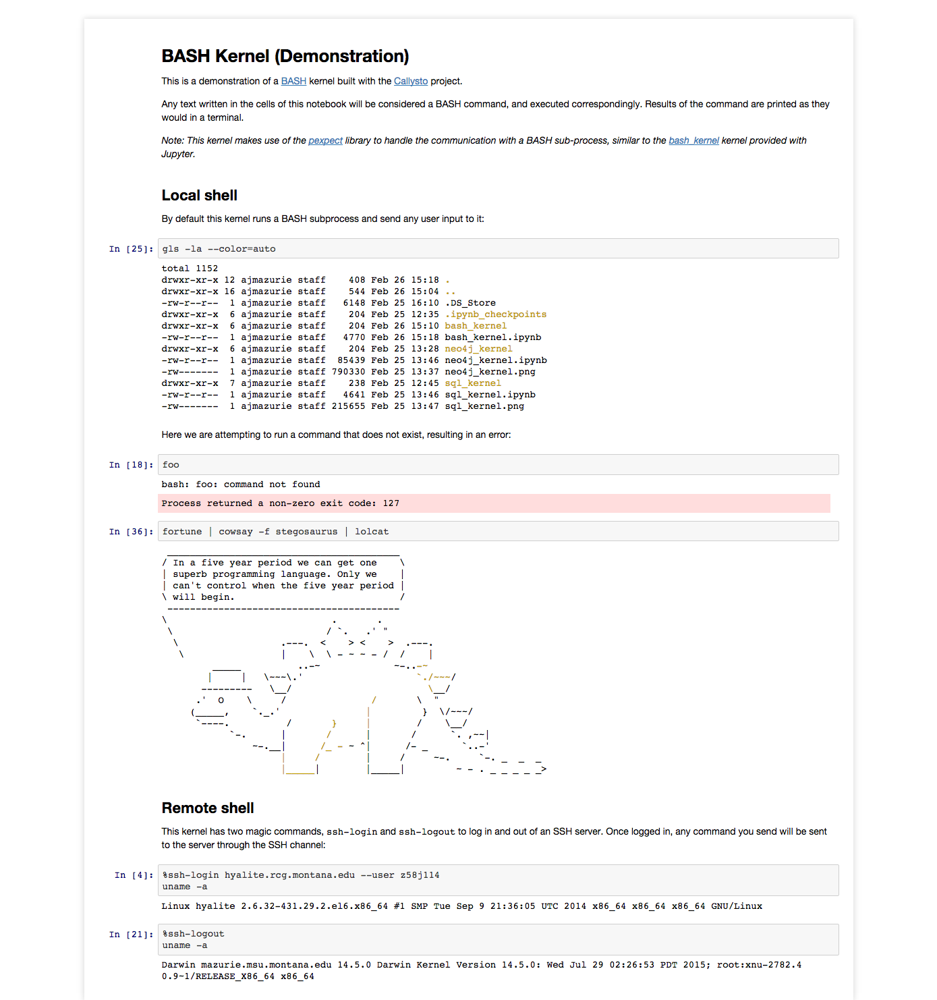
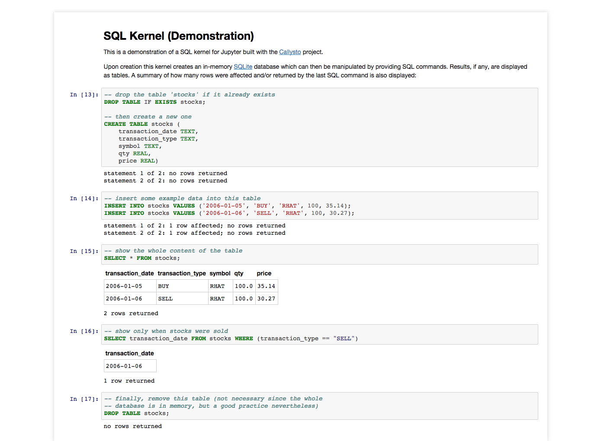
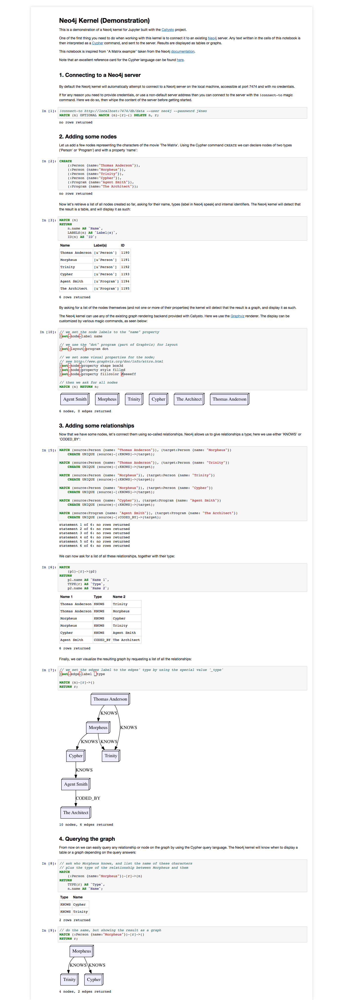

# Callysto: Example kernels

**Callysto** is a [Python](http://www.python.org/) framework to create domain-specific kernels for the [Jupyter](http://jupyter.org/) notebook platform. It is open source, and [available on GitHub](https://github.com/ajmazurie/callysto).

This repository contains example kernels developed on top of **Callysto** to showcase its features.

## BASH Kernel

Inspired by the [kernel](https://github.com/takluyver/bash_kernel) developed by Thomas Kluyver, here is a kernel mimicking a [BASH](https://en.wikipedia.org/wiki/Bash_%28Unix_shell%29) terminal. It supports connecting to another server through SSH:

## SQL Kernel

This kernel creates an interactive terminal for working with an in-memory SQL ([SQLite](https://www.sqlite.org/)) database server, allowing students to experiment with the [SQL language](https://en.wikipedia.org/wiki/SQL):

## Neo4j Kernel

This kernel creates an interactive terminal for working with a [Neo4j](http://neo4j.com/) graph database server. Not only it allows users to experiment with the [Cypher](https://en.wikipedia.org/wiki/Cypher_Query_Language) query language, but the results can be displayed as graphs directly in the Jupyter notebook:

